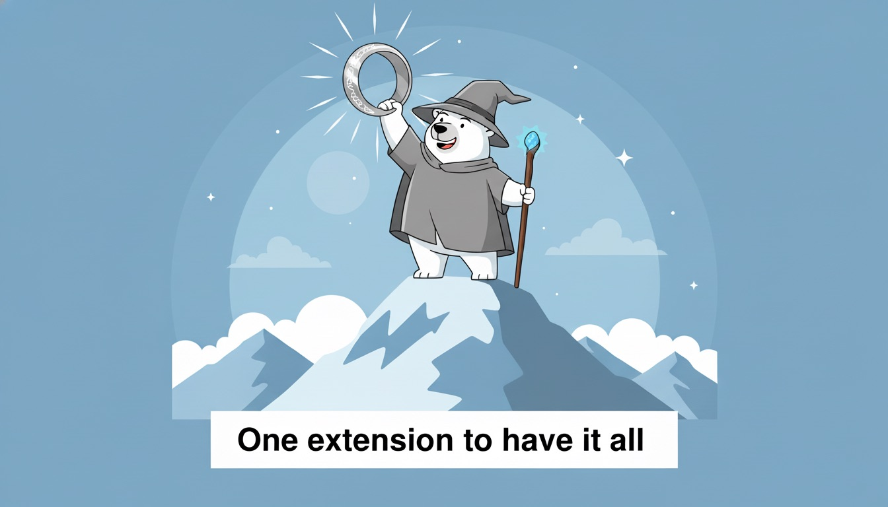

# Nenya: Your Universal Browser Companion

**Nenya empowers you to seamlessly manage your browsing sessions, bookmarks, and data across all your browsers, so you're never locked into a single ecosystem.**

Nenya is the ultimate browser extension for users who refuse to be tied down to a single browser. It provides a comprehensive suite of tools to manage your tabs, sessions, and bookmarks, and makes it easy to take your data with you, no matter which browser you're using. With Nenya, you can create "projects" of tabs, integrate with Raindrop.io, and enjoy a variety of content interaction features that enhance your browsing experience.

## Features

- **Project Management:** Save and restore entire browsing sessions as "projects."
- **Cross-Browser Sync:** Easily move your projects and data between different browsers.
- **Raindrop.io Integration:** Sync your bookmarks with the popular bookmarking service.
- **Split Screen:** View multiple web pages in a single tab with a resizable split-screen view.
- **Clipboard Tools:** A variety of tools to copy URLs, titles, and even screenshots to your clipboard.
- **Content Enhancement:** Features like custom titles, video controller, and text highlighting to improve your browsing experience.
- **Element Blocker:** Block distracting elements on web pages.
